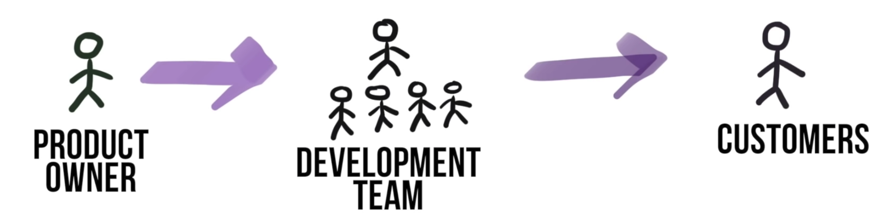
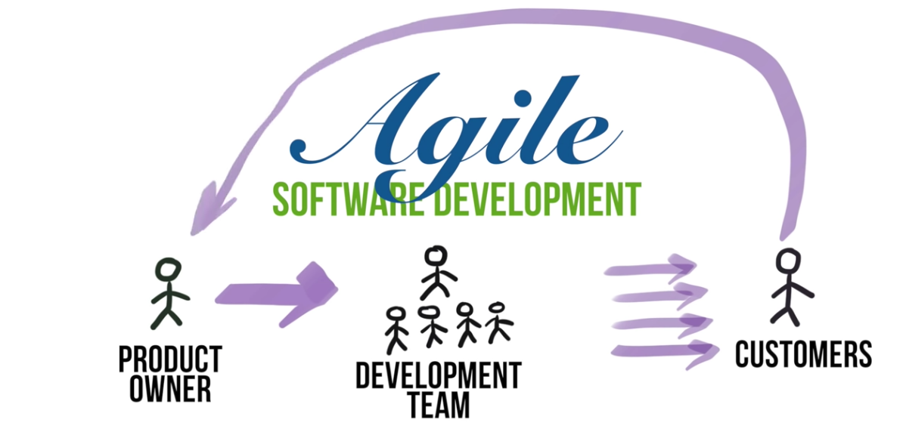
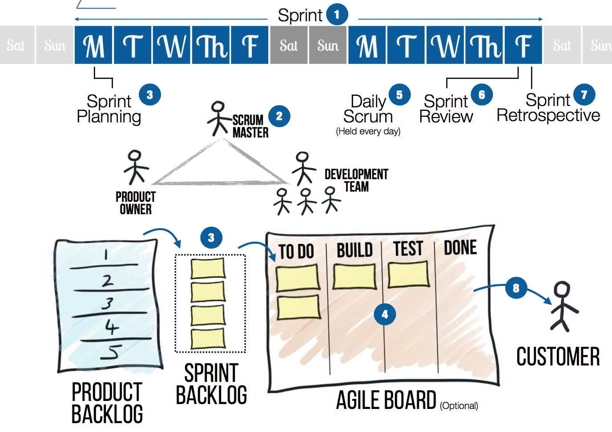
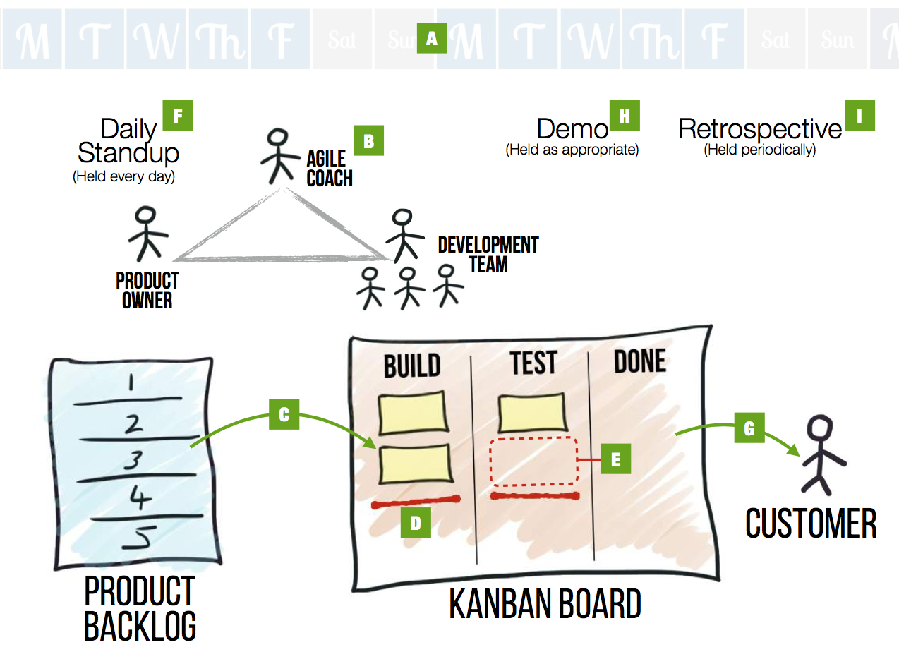

# Week 3: Agile

* [What is Agile?](#what-is-agile)
* [Agile in Practice: Scrum & Kanban](#agile-in-practice-scrum--kanban)
  * [Scrum](#scrum)
  * [Kanban](#kanban)
  * [A note on User Stories](#a-note-on-user-stories)
* [Scrum in Github](#scrum-in-github)
* [Resources](#resources)

## What is Agile?

It is _not_ a methodology or specific process.

Agile is a set of values and principles that encourages better ways to develop software. Its core beliefs are written in the [Agile Manifesto](https://agilemanifesto.org/). 

Agile values
* __Individuals and interactions__ over processes and tools
* __Customer collaboration__ over contract negotiation
* __Working software__ over comprehensive documentation
* __Responding to change__ over following a plan

Additionally, Agile has 12 principles:

1. Satisfy the customer through __early__ and __continuous__ delivery of __valuable__ software.
2. Welcome changing requirements, even late in development.
3. Deliver working software __frequently__.
4. Business people and developers must work __together__ daily
5. Your __team__ is everything. Give them the environment and support they need, and trust them to get the job done.
6. The most effective communication is __face-to-face__ conversation.
7. __Working__ software is the primary measure of progress.
8. Promote __sustainable__ development. The team should be able to maintain a constant pace indefinitely.
9. Continuous attention to __technical excellence__ and __good design__ enhances agility.
10. __Simplicity__ - the art of maximizing the amount of work not done - is essential.
11. Allow your team to __self-organize__.
12. __Reflect__ regulary, and __adjust__ your behavior accordingly.

## Agile in Practice: Scrum & Kanban

There are many ways development teams practice agile. Two of the most common are __Kanban__ and __Scrum__.

In order to understand why Kanban/Scrum are so powerful, let's first look at a more traditional development methodology: Waterfall. 

The product "flows down" from the Product Owner, through the Dev Team, and eventually ends with the Customer (where it stays).

This is _not_ agile. It goes against several agile principles:
* Favors contract negotiation over customer collaboration (requirements are set early, the customer provides no feedback)
* Prioritizes a specific plan over responding to change (the waterfall cannot be traversed the opposite way)

Agile software development, on the other hand, is focused on __continuous delivery__ and __feedback__.

1. The product owner, along with other __stakeholders__, takes the feedback from the customers and compiles a __backlog__ of features. 
2. Features are built individually and shipped to the customer as soon as they are ready. This is the __development cycle__ 
3. Customer interacts with the new version of the software and provides feedback. The feedback can be requesting __new features__ or reporting __bugs__ on older features. 
4. Feedback enters the backlog, and the cycle repeats.

Kanban/Scrum are two ways of implementing the development cycle.

Both methodologies center around a board used to track features as they travel from the backlog to release.

The main difference between Kanban and Scrum is how the team runs their development cycle. Scrum has __sprints__, Kanban has __continuous__ development.

### Scrum

### Kanban

### A note on User Stories
In agile-land, features are often tracked as __user stories__. 
In order to maintain consistency and agility, most teams use a specific syntax for their user stories.

## Scrum in Github

## Resources
* [Manifesto for Agile Software Development](https://agilemanifesto.org/)